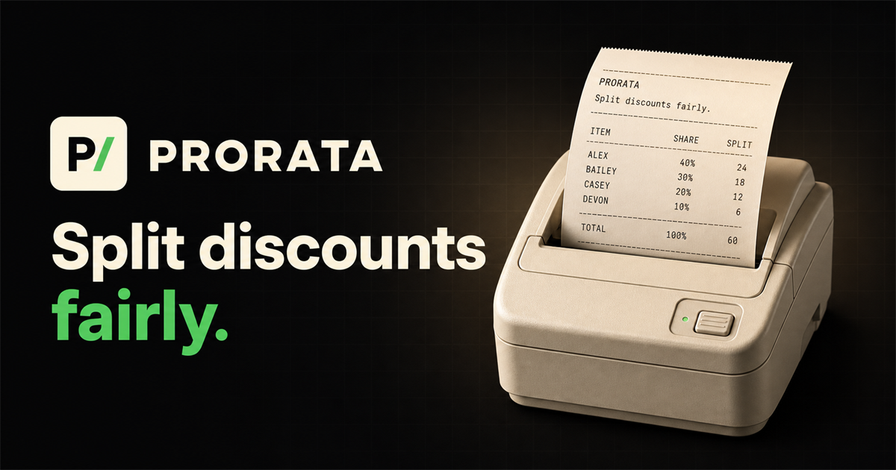

<div align=center>

# PRORATA

### Split discounts fairly.

The fast, transparent way to calculate what everyone should pay after discounts, vouchers, cashback, delivery fees, and other shared costs.

**[Try PRORATA live](https://prorata.yamustofa.workers.dev/)**

</div>

[](https://prorata.yamustofa.workers.dev/)

## The fair answer to “So… how much do I pay?”

A group order looks simple until the voucher arrives. Splitting the final total equally is rarely fair, while doing the math by hand means calculators, spreadsheets, rounding errors, and a receipt nobody wants to explain.

PRORATA handles the awkward part. Add each person's original bill, the total discount, and any extra fees. In seconds, everyone gets a proportional share of the savings and a clear final amount to pay.

It is built for the moments that happen every day:

- 🍕 **Food delivery** — divide GoFood, GrabFood, or ShopeeFood promos by each person's order
- 🛒 **Group shopping** — share discounts and cashback without favoring the biggest or smallest item
- 🎁 **Shared purchases** — settle gifts, groceries, subscriptions, and event expenses clearly
- 🚕 **Shared rides** — distribute vouchers and additional charges by each rider's portion

## Fair by design. Simple by default.

**Proportional, not merely equal.** Someone responsible for 40% of the original bill receives 40% of the discount and fees. Everyone benefits according to their share.

**Ready in under a minute.** The focused, guided flow takes you from order totals to participant bills and a complete result—without accounts, spreadsheets, or setup.

**Easy to trust.** PRORATA shows the original subtotal, discount, fees, individual savings, and final payments so the numbers never feel like a black box.

**Made to share.** Turn the result into a polished receipt, save it as a high-resolution PNG, copy it as text, or send it through your device's native share menu.

## One shared order. Three quick steps.

1. **Enter the order** — add an optional name, total discount, and delivery or service fees.
2. **Add everyone** — enter each participant and their original bill before adjustments.
3. **Share the result** — review the reconciled split and send the receipt to the group.

PRORATA works in Bahasa Indonesia and English, supports IDR and USD, adapts from phone to desktop, and includes light and dark themes. Reduced-motion preferences are respected throughout the experience.

> **Everyone pays their fair share. No more. No less.**

## How the calculation stays exact

Each participant's original bill becomes their allocation weight:

```text
weight          = individual bill / subtotal
net adjustment  = total discount - total fees
adjustment share = net adjustment × weight
final payment   = individual bill - adjustment share
```

Money is stored as integer units—whole rupiah for IDR and cents for USD. Fractional allocations are reconciled with the largest-remainder method and a deterministic tie-breaker, guaranteeing that every participant amount adds back to the exact order total:

```text
sum(final payments) = subtotal - discount + fees
```

The allocation engine lives in [`src/lib/calculation.ts`](src/lib/calculation.ts) and is verified by [`src/lib/calculation.test.ts`](src/lib/calculation.test.ts).

## Built for a fast, dependable web experience

PRORATA is built with React 19, TypeScript, TanStack Start and Router, Tailwind CSS 4, and shadcn/ui with Base UI primitives. Motion powers the interaction details, Vitest covers the calculation engine, Biome keeps the codebase consistent, and Cloudflare Workers serves the production app globally.

### Run it locally

Requires [Bun](https://bun.sh/) 1.3 or newer. No application environment variables are required.

```bash
bun install
bun run dev
```

Open `http://localhost:3000` (Vite will use another port if 3000 is unavailable).

| Command | Purpose |
| --- | --- |
| `bun run dev` | Start the development server |
| `bun run test` | Run the Vitest suite |
| `bun run check` | Run Biome checks |
| `bun run build` | Create a production build |
| `bun run preview` | Preview the production build |
| `bun run deploy` | Build and deploy to Cloudflare Workers |

For product direction and messaging, see [`docs/BRAND_REPOSITION.md`](docs/BRAND_REPOSITION.md). The original product requirements are documented in [`docs/PRD.md`](docs/PRD.md).

---

<div align=center>

Built by [yamustofa](https://github.com/yamustofa/) · **[Open PRORATA](https://prorata.yamustofa.workers.dev/)**

</div>
