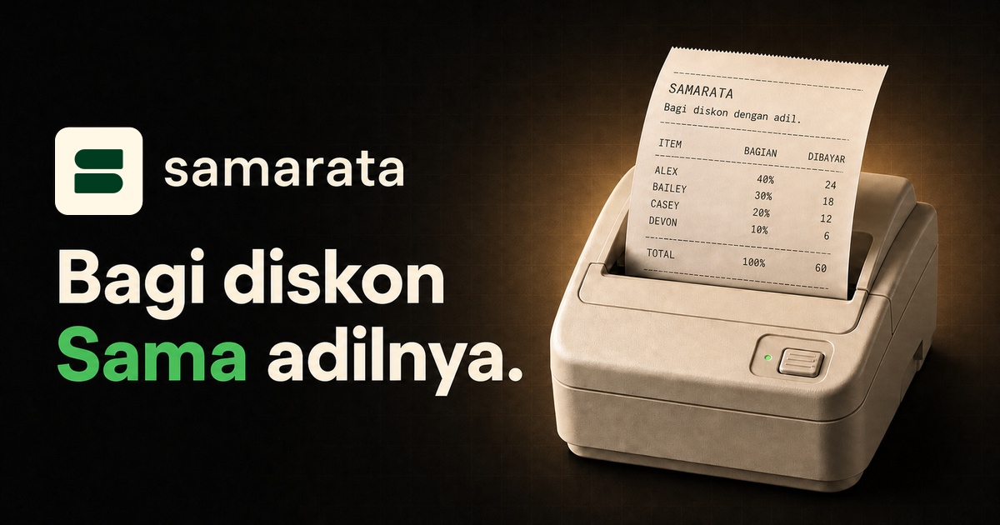

<div align="center">

**Bahasa Indonesia** · [English](README.en.md)

# samarata

### Bagi diskon dengan adil.

Cara gampang dan transparan buat menghitung berapa yang harus dibayar masing-masing setelah diskon, voucher, cashback, ongkir, dan biaya lainnya.

**[Coba samarata](https://samarata.yamustofa.workers.dev/)**

</div>

[](https://samarata.yamustofa.workers.dev/)

## Biar ada jawaban kalo ditanya, “Jadi… aku bayar berapa?”

Pesan rame-rame dapet diskonan rame-rame. Kalau total akhirnya langsung dibagi rata, hasilnya belum tentu adil. Kalau dihitung manual, ujung-ujungnya buka kalkulator, bikin spreadsheet, ketemu selisih pembulatan, lalu bingung menjelaskan hasilnya ke grup.

Di sinilah samarata bantu. Tinggal masukkan tagihan awal tiap orang, total diskon, dan biaya tambahan. Beberapa detik kemudian, langsung kelihatan berapa bagian yang adil dan berapa yang perlu dibayar masing-masing.

samarata bisa dipakai buat banyak hal sehari-hari:

- 🍕 **Pesan makanan** — bagi promo GoFood, GrabFood, atau ShopeeFood sesuai harga pesanan masing-masing
- 🛒 **Belanja bareng** — bagi diskon dan cashback tanpa bikin satu orang untung sendiri
- 🎁 **Patungan** — bereskan pembayaran hadiah, belanja bulanan, langganan, atau kebutuhan acara
- 🚕 **Naik kendaraan bareng** — bagi voucher dan biaya tambahan sesuai porsi tiap penumpang

## Adil hitungannya. Gampang dipakainya.

**Proporsional, bukan asal dibagi rata.** Kalau tagihan awal seseorang adalah 40% dari total, ia juga mendapat 40% dari penyesuaian bersih—diskon setelah dikurangi biaya bersama.

**Nggak sampai semenit.** Mulai dari isi total pesanan sampai hasil pembagian, semuanya bisa selesai tanpa bikin akun, buka spreadsheet, atau ribet atur ini-itu.

**Hitungannya kelihatan jelas.** Subtotal, diskon, biaya, penyesuaian tiap orang, dan pembayaran akhir semuanya ditampilkan—jadi nggak ada angka misterius.

**Tinggal bagikan.** Hasilnya bisa dijadikan struk, disimpan sebagai PNG, disalin sebagai teks, atau langsung dikirim lewat menu share di perangkatmu.

## Cuma tiga langkah

1. **Isi detail pesanan** — tambahkan nama kalau perlu, lalu masukkan total diskon, ongkir, dan biaya layanan.
2. **Masukkan yang ikut** — isi nama dan tagihan awal masing-masing sebelum diskon.
3. **Cek lalu bagikan** — pastikan hasilnya sudah oke, lalu kirim struknya ke grup.

samarata tersedia dalam Bahasa Indonesia dan Inggris, mendukung IDR dan USD, enak dipakai dari HP sampai desktop, dan punya tema terang maupun gelap. Kalau perangkatmu mengurangi animasi, samarata juga akan ikut menyesuaikan.

> **Semua bayar sesuai porsinya. Nggak lebih, nggak kurang.**

## Biar hitungannya tetap pas

Tagihan awal tiap orang dipakai sebagai bobot pembagian:

```text
bobot              = tagihan individu / subtotal
penyesuaian bersih = total diskon - total biaya
bagian penyesuaian = penyesuaian bersih × bobot
pembayaran akhir   = tagihan individu - bagian penyesuaian
```

Semua nominal disimpan sebagai angka bulat—rupiah untuk IDR dan sen untuk USD. Kalau ada pecahan dari hasil pembagian, samarata merapikannya dengan metode sisa terbesar dan aturan yang konsisten. Hasil akhirnya tetap pas sampai satuan terkecil:

```text
jumlah(pembayaran akhir) = subtotal - diskon + biaya
```

Biar nggak ada pembayaran yang jadi negatif, diskon nggak boleh lebih besar dari subtotal awal ditambah biaya bersama:

```text
diskon ≤ subtotal + biaya
```

Contohnya, ada dua tagihan awal sebesar Rp3.000 dan Rp5.000, diskon Rp10.000, serta biaya Rp5.000:

```text
subtotal           = Rp8.000
penyesuaian bersih = Rp10.000 - Rp5.000 = Rp5.000
peserta pertama    = Rp3.000 - 37,5% × Rp5.000 = Rp1.125
peserta kedua      = Rp5.000 - 62,5% × Rp5.000 = Rp1.875
total akhir        = Rp3.000
```

Kalau biayanya lebih besar daripada diskon, rumus yang sama akan membagi selisihnya sebagai biaya tambahan proporsional.

Logika pembagiannya ada di [`src/lib/calculation.ts`](src/lib/calculation.ts) dan dites lewat [`src/lib/calculation.test.ts`](src/lib/calculation.test.ts).

## Di balik layar

samarata dibuat dengan React 19, TypeScript, TanStack Start dan Router, Tailwind CSS 4, serta shadcn/ui dengan komponen dasar Base UI. Motion mengurus detail animasi, Vitest menjaga logika perhitungan tetap aman, Biome merapikan kode, dan Cloudflare Workers menjalankan aplikasinya secara global.

### Jalanin di lokal

Kamu butuh [Bun](https://bun.sh/) 1.3 atau yang lebih baru. Nggak ada environment variable yang perlu disiapkan.

```bash
bun install
bun run dev
```

Buka `http://localhost:3000`. Kalau port 3000 sedang dipakai, Vite otomatis memilih port lain.

| Perintah | Kegunaan |
| --- | --- |
| `bun run dev` | Nyalakan server development |
| `bun run test` | Jalankan semua tes Vitest |
| `bun run check` | Cek kode dengan Biome |
| `bun run build` | Buat production build |
| `bun run preview` | Lihat production build di lokal |
| `bun run deploy` | Build dan deploy ke Cloudflare Workers |

Kalau mau lihat arah produk dan pesan brand-nya, buka [`docs/BRAND_REPOSITION.md`](docs/BRAND_REPOSITION.md). Kebutuhan produk awalnya ada di [`docs/PRD.md`](docs/PRD.md).

---

<div align="center">

Dibikin oleh [yamustofa](https://github.com/yamustofa/) · **[Buka samarata](https://samarata.yamustofa.workers.dev/)**

</div>
